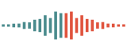
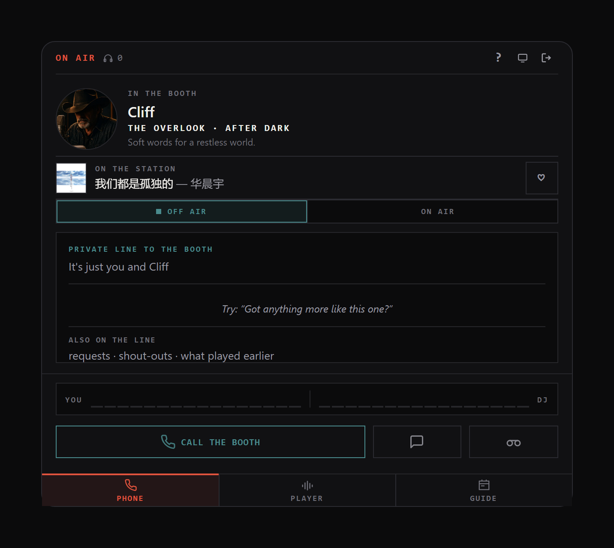
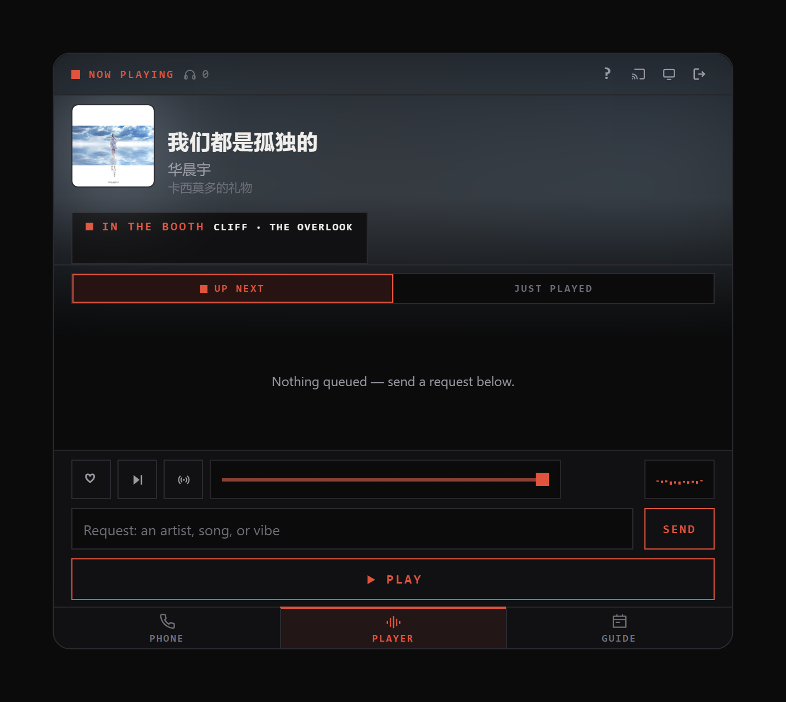
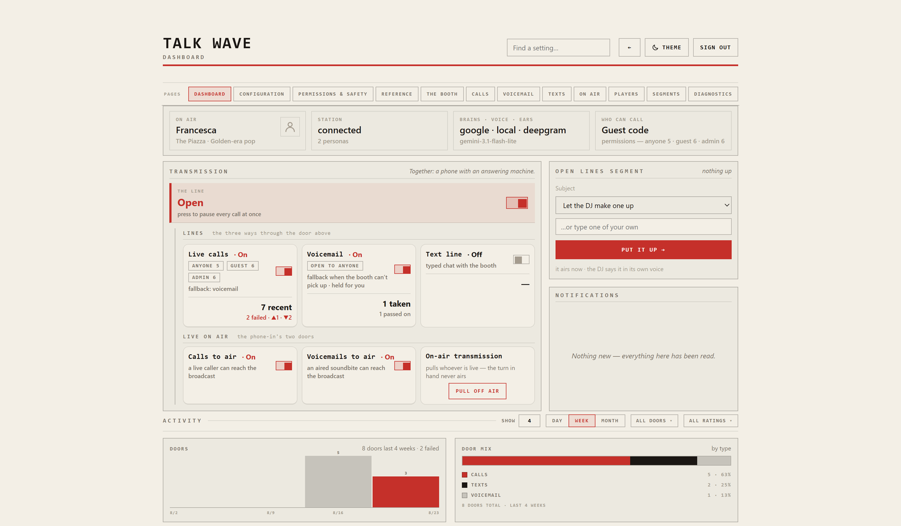
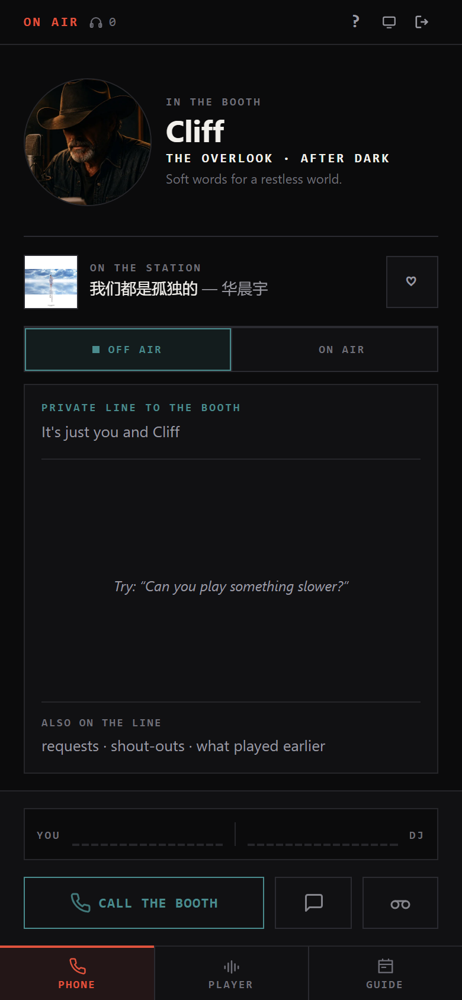
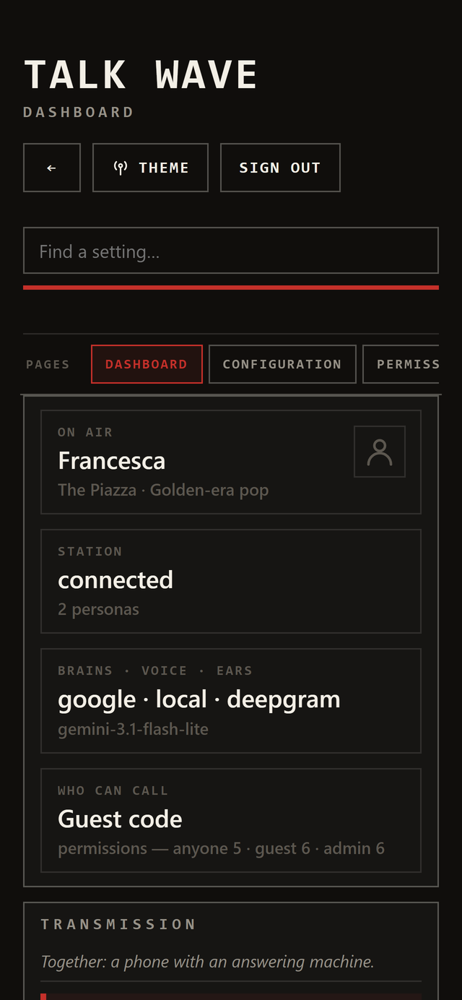
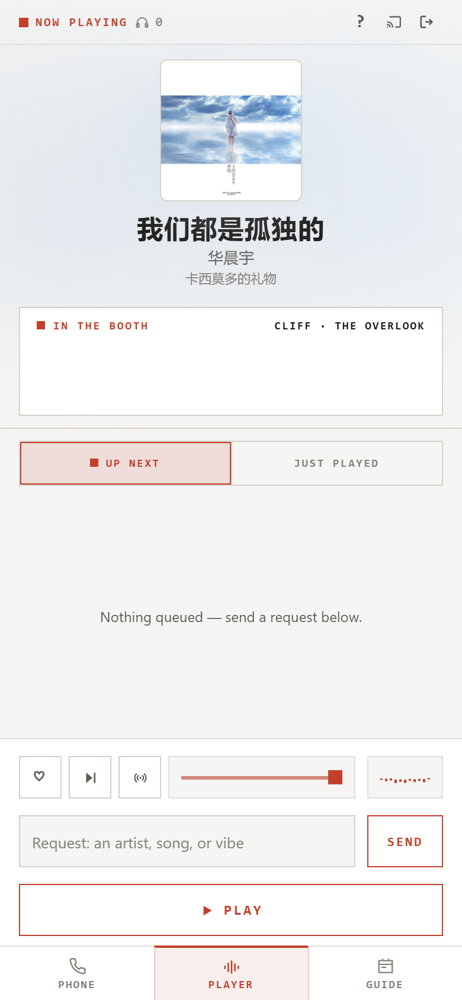

<p align="center">
  
</p>

<h1 align="center">Talk-Wave</h1>

## What it is

**A call-in phone line for your [SUB/WAVE](https://github.com/perminder-klair/subwave) AI radio station.** A listener presses one button in the browser and talks with whoever is live on air — and the DJ can act on the station mid-call: find a record by name or by how it *sounds*, queue it, take it back out again, put a shoutout on the broadcast.

The call is not the station speaking. It's this sidecar's own realtime voice agent wearing the live persona, and the station is only touched when the agent uses an allowlisted tool.

> **Note:** this was created with use of AI. It is recommended to use it locally, and only expose it externally if you know the risks and what you are doing.

<table>
<tr>
<td width="34%" valign="top"></td>
<td width="33%" valign="top"></td>
<td width="33%" valign="top"></td>
</tr>
<tr>
<td valign="top"></td>
<td valign="top"></td>
<td valign="top"></td>
</tr>
</table>

▶ **[Watch a real call (2 min)](docs/talkwave-call.mp4)** — in-persona pickup, back-and-forth, and a Beatles request resolved against the live library.

## How it works

```
[browser mic] --WebRTC--> [livekit-server] --> [talkwave-worker]
                                                STT -> LLM -> TTS
                                                     |
                                          SUB/WAVE MCP (allowlisted)
```

Your voice reaches a speech-to-text engine, an LLM answers as the DJ who is on air right now, and a text-to-speech voice says it back — a full loop every turn, with the station's own tools attached. Everything runs on **your** hardware and **your** API keys (or fully local with Ollama and the bundled Whisper). The author runs no servers; nothing phones home.

## Features

**Three ways to reach the booth**
- **Live calls** — full-duplex voice with barge-in, live captions, and a DJ who knows the show it's on.
- **Voicemail** — greetings staged in each DJ's own voice; messages held for you, sent to the station, or AI-triaged. Or run the line as a **soundbite studio**: the caller records a take, reviews the transcript and exactly what sending will do, and their own voice airs with the DJ around it. See [Voicemail](docs/VOICEMAIL.md).
- **The text line** — the same DJ, typed. Works where WebRTC can't.

**A real station on the other end**
- Station tools through a hard allowlist — the audience-reaching ones off by default, the destructive ones never exposed.
- **On-air ducking** — while the broadcast DJ is talking, the call waits its turn. Nothing overlaps, nothing is lost.
- **Or quiet the station instead** — flip it the other way: the station's own idents, links and segments stand down while a call is live and return within seconds of it ending. Music never stops, and the operator's hand on the station's own Voice switch always wins. See [Live on air](docs/on-air.md#quieting-the-stations-own-dj).
- **Live on air** — a caller can go out on the broadcast itself: the conversation airs one finished turn at a time, a turn behind the room, with a pull-off-air button in your hand the whole way. See [Live on air](docs/on-air.md).
- Personas, voices and themes discovered live. Point it at another SUB/WAVE and it re-homes itself.
- Every caller action gets its own transcript line — the receipt behind whatever the DJ *says* it did. [The whole list](#what-a-caller-can-make-happen).

**Speech, both directions**
- **LLM**: OpenAI, Anthropic, Google, DeepSeek, OpenRouter, Requesty, Vercel AI Gateway — or your own box with no key at all: Ollama, any OpenAI-compatible server (llama.cpp, vLLM, LM Studio), or the station's locca. [What to run](docs/models.md) says which actually carry a call.
- **STT**: bundled Whisper (no key, no network) or cloud ears (Deepgram, OpenAI, Google). Echo cancellation on by default.
- **TTS**: any OpenAI-compatible endpoint via JSON adapters — ElevenLabs, Fish Audio, and the station's own `/speak` in the box.
- **Voice effects**: ten colours — telephone, CB, walkie-talkie, AM, megaphone, underwater, stadium PA, intercom, shortwave, lo-fi — per persona, with an intensity dial.

**A player people actually use**
- Installs to a phone like an app, and reads like one.
- Embeds in two lines of HTML — inline card, launcher pill, docked bar, or pop-up. See [Embedding](#embedding).
- Themes: light, dark, match-the-page, or the station's live show colours. Every string on the card overridable.
- The card says how many are tuned in and offers the same heart any listener page has — both optional, both on by default.
- Call sounds from shipped sets — synthesized classics, real public-domain line tones — every slot replaceable with your own.
- Push to talk, a post-call thumbs, and in-character timeouts so silence never just hangs there.

**Gated like a phone line, not a demo**
- Three caller tiers — admin, guest code, open — and a per-feature permission matrix: each action goes to the least trusted tier that should have it, or nobody.
- Usage caps on everything a call can cost, and a kill switch that outranks it all.
- PBKDF2 passwords with lockouts, write-only keys, two-minute call tokens — and a fresh install answers nobody until its admin password is set. See [Security](docs/security.md).

**An operator's panel that tells the truth**
- A dashboard that acts (toggles post instantly, no save) and reads (on air, station health, activity charts).
- Settings apply to the **next caller** — no restarts, ever.
- Diagnostics run the real code paths: green means a call will work, not "the URL responded".

## What a caller can make happen

Every action here is a real tool the DJ can reach — on a call, on the text line, or out of a voicemail — and every one is a switch you can turn off. Anything that changes the station leaves its own card in the caller's transcript, so what happened is never only the DJ's word for it.

**Just asking** — reads the station, changes nothing, leaves no card

| Ask about | Say something like |
|---|---|
| **What's on air** | "What's this one?" · "Who's playing?" · "How many are listening tonight?" |
| **The words** | "What's she actually singing there?" · "Have you got the lyrics for this?" |
| **What just played** | "What was on before this?" · "Did my song ever play?" · "What did you play around eleven?" |
| **What's coming up** | "What's in the queue?" · "Where's my song in the running order?" |
| **What's in the booth** | "Who's on tonight?" · "What have you been talking about?" · "What show is this?" |
| **What's on later** | "What's on after you?" · "When's After Dark on?" |
| **What's in the library** | "Have you got any Fleetwood Mac?" · "What jazz have you got from the sixties?" · "What's new in?" |
| **By feel, not by name** | "Something dreamy and cinematic?" · "Got anything that sounds more like this one?" |
| **What the audience loves** | "What do people round here play most?" · "You pick — what's good?" |

**Into the queue**

| Receipt | Say something like |
|---|---|
| 🎵 **Song request scheduled** | "Any chance of some Fleetwood Mac?" · "Something for late-night driving." · "Got anything from the late seventies?" |
| 💿 **Album queued** | "Have you got Rumours? Play the whole thing." · "Put on Kind of Blue, start to finish." |
| 🎶 **Mix queued** | "Queue up a mix of 90s rock." · "Make me a mix for a rainy Sunday." · "Line up some Motown for the next half hour." |
| 🚫 **Queued track pulled** | "Actually, scrap that last one." · "Take Go Your Own Way back off, would you?" |
| 🧹 **Queued tracks cleared** | "Take all the Bowie back out." · "Clear everything I asked for." · "Cancel that 90s rock mix you just queued." |

**The record on air**

| Receipt | Say something like |
|---|---|
| ❤️ **Liked the track on air** | "I love this one — give it a like." · "Heart that for me." |
| 🤍 **Removed the like** | "Actually, take the like off this." · "Undo that heart." |
| ⏭ **Current track cut short** | "Can you skip this one?" · "Not for me — next, please." |

**Out to every listener**

| Receipt | Say something like |
|---|---|
| 📢 **Message sent to air** | "Can you say hi to my brother on air?" · "Tell everyone it's Danny's last night shift." |
| 🎙 **Station segment running** *(segments / skills)* | "What's the weather doing?" · "Any news tonight?" · "Give my mate a dedication." |
| 📻 **Station beat on air** | "Do the station ident." · "Read the time out for us." |

**Still running after they hang up**

| Receipt | Say something like |
|---|---|
| 🔀 **Show takeover set** | "Any chance of putting the late show on?" · "Can we have After Dark for an hour?" |
| 📅 **Takeover cancelled** | "Actually, put it back to normal." · "Cancel that — back to the schedule." |
| 🔒 **Station locked to a genre** | "Keep it to jazz for the next couple of hours." · "Nothing but soul for a while." |
| 🔓 **Genre lock lifted** | "You can drop the jazz thing now." · "Let it off the leash again." |
| ❌ **Banned from the station** | "Never play this one again." · "Bin that off the station permanently." |
| ↩️ **Back in rotation** | "Actually, let that one back in." · "Take it off the never-play list." |

**Not an action**

| Receipt | Say something like |
|---|---|
| ⛔ **Call limit reached** | The cap says so itself, once, before the DJ gets a word in — so a refusal can never be dressed up as the station's fault |

Which of these a caller can reach at all is the [permission matrix](docs/settings.md#caller-permissions)'s business: each action goes to the least trusted tier that should have it, or to nobody.

## Before you start

What a deployment actually needs, so nothing surprises you at step three:

- **A SUB/WAVE station, running.** Talk Wave is its companion phone line, not a standalone radio — personas, cards, voices and tools all come from the station.
- **A Docker host on the same network** — a NAS is fine; that is where this was built. (Windows-local without Docker also works, for development.)
- **One LLM API key** — or a local Ollama, which needs none. Calls spend **your** key: the usage caps exist so a stranger can't spend it for you, and they're on by default. [What to run](docs/models.md) is the short version of which model and voice actually carry a call.
- **HTTPS is non-negotiable for calls** — browsers only grant the microphone to secure origins. The bundled Caddy gives you that on a LAN with zero config (one certificate screen, once); a real domain removes even that. See [networking](docs/networking.md).
- **LAN first.** Get a call working on your own network before exposing anything — and when you do expose it, [security](docs/security.md) is the checklist, with a guest code and the admin password set before the port opens.
- **Callers from outside your network** need one router rule (a single UDP port) and one compose line — [networking](docs/networking.md) walks it.

## Getting started

**The one-command version:**

```bash
curl -fsSL https://raw.githubusercontent.com/mrain1p/Talk-Wave/main/install.sh | bash
```

**The ten-minute version: [docs/quickstart.md](docs/quickstart.md)** — what you need, the five commands, first run, backup. The sections below are the same path with more said.

### Docker (recommended)

Images publish to `ghcr.io/mrain1p/talk-wave`; `:latest` tracks `main`. The image includes the widget. A deploy needs four files and one empty folder:

```
talk-wave/
├── docker-compose.yaml    # from this repo
├── Caddyfile              # from this repo — the TLS front door mounts it
├── .env                   # from .env.example — REQUIRED
├── livekit.yaml           # from livekit.example.yaml, with a fresh secret
└── data/                  # empty; the app fills it, and it IS the backup
```

```bash
cp .env.example .env
cp livekit.example.yaml livekit.yaml   # generate a fresh secret for it
mkdir -p data && chown -R 1000:1000 data && chmod -R u+rwX data
docker compose up -d
```

> **`data/` must belong to uid 1000** — both processes run as it, and that is what the `chown` line does. Skip it and the app can't read its own files: no setup ask, a locked panel, and the reason named at the login gate and in the logs.

**Two variables in `.env`, and that is all it has to say:**

| Variable | What it is |
|---|---|
| **`HOST_IP`** | The docker host's LAN address. Drives LiveKit's advertised media address, the browser URL, and the webhook callback |
| **`SUBWAVE_STREAM_URL`** | The station's public `https://` stream. A bare origin is enough — the published mounts are discovered, mp3 first |

The LiveKit keypair is read from the mounted `livekit.yaml` (env still overrides), so the secret lives in one file. The rest is panel.

> **Set `SUBWAVE_STREAM_URL` first — it fails silently.** Left blank it derives from the station's own address, which is plain http on the LAN. The widget must be served over TLS for the microphone to work, so the browser blocks that stream as mixed content and the caller hears no station.

**Then open `https://<HOST_IP>:8443`** — the bundled Caddy TLS front door. Browsers only allow the microphone on HTTPS origins, and the first visit shows a one-time certificate screen. Set the admin password, add an API key, run the pipeline check, press Call.

Plain `http://<HOST_IP>:8100` reaches everything except placing calls — but it is the admin panel in the clear. Type your password and keys at the `:8443` door, never over `:8100`. See [security](docs/security.md).

<details>
<summary><b>Already run your own reverse proxy? (Caddy, Traefik, nginx, a NAS's built-in one)</b></summary>

The bundled Caddy is there only for TLS, and only because the microphone requires it — it is the zero-config way to get an HTTPS origin on a LAN.

Delete the `caddy` service and terminate TLS in your own proxy instead, but **replicate both routes from the `Caddyfile`, not just one**:

- the widget → `talkwave-web:8100`
- `/rtc` → `livekit-server:7880` (WebSocket)

**The `/rtc` half is the one people forget.** Without it the page loads, the call connects, and no audio ever flows.

Then set `LIVEKIT_PUBLIC_URL` to `wss://your-hostname`, so the browser signals through the same origin.

</details>

### Local, no Docker (Windows)

```powershell
python -m venv .venv
.\.venv\Scripts\pip install -r agent-worker\requirements.txt
# put livekit-server.exe in bin\  (github.com/livekit/livekit/releases)
copy .env.example .env
copy livekit.example.yaml livekit.yaml
.\run-local.ps1        # stop with .\run-local.ps1 -Stop
```

## Privacy

**There is no third party anywhere in the path.** The author runs no servers at all, nothing phones home, and there is no telemetry.

**Station admin credentials are optional, and never leave your box.** Entering your SUB/WAVE admin login unlocks the advanced on-air features — putting a different show on air, running segments and skills, skipping tracks, mirroring persona voices. Without it, everything else still works.

- Entered by the operator into their **own self-hosted instance**.
- Stored server-side and **write-only** — the panel shows a fixed mask, never the value, never its length.
- Kept behind the instance's own admin password.
- Every caller-facing action they unlock is **off by default**, and individually permission-gated.

**Two things worth knowing as an operator:**

- **Caller audio** is processed by whichever speech and AI providers *you* configure — fully local with Ollama and the bundled Whisper, or on your own cloud keys.
- **Calls can be transcribed and stored** on your own server, with configurable retention. The card shows a Recording indicator whenever that is on.

And no caller reaches the broadcast stream unless you open the [on-air doors](docs/on-air.md) — shipped shut, chosen per caller, running a turn behind the room, with a pull-off-air button in your hand.

## Documentation

The README is the short version. The detail lives here:

| | |
|---|---|
| **[Quick start](docs/quickstart.md)** | Nothing to a working call in ten minutes |
| **[What to run](docs/models.md)** | Which model and voice, ideal to minimal, and where a caller notices |
| **[Settings reference](docs/settings.md)** | Every setting, its default, and what it changes |
| **[The dashboard](docs/dashboard.md)** | The panel's landing page: the station tiles, the Transmission switch ladder and its one rule, the pull, and the activity charts |
| **[Calling from outside your network](docs/networking.md)** | The topologies, the TLS front door, and why a call can connect with no audio |
| **[Security and privacy](docs/security.md)** | The exposure checklist, the two passwords, what is enforced |
| **[Troubleshooting](docs/troubleshooting.md)** | Known limits, reading a call back, logs and tests |
| **[Voicemail](docs/VOICEMAIL.md)** | The answering machine and the soundbite studio: staged greetings, where messages go, and the terms on which anything is recorded |
| **[Live on air](docs/on-air.md)** | The phone-in on the broadcast: what listeners hear, the three consents, the pull, and the wiring both containers need |
| **[How a call actually works](docs/the-call.md)** | The path one sentence takes: the prompt and what it costs, the tool surface, how a request is triaged, and everything that can make the DJ speak |

## Under the hood

| Component | What it does |
|---|---|
| `livekit-server` | WebRTC media — one room per call |
| `talkwave-worker` | Resolves the persona, builds the prompt, runs STT → LLM → TTS with MCP tools attached |
| `talkwave-web` | Mints join tokens (the browser never sees LiveKit secrets), serves widget and panel, proxies station reads |
| `web-widget` | The call page — installable to a phone's home screen, or a compact embeddable card |

Inside the worker:

- **One call is one `CallSession`**, and every file under `agent-worker/call/` is named after its job.
- **The tool allowlist is declared once**, in `registry.py` — the runtime surface and the panel's reference both derive from it.
- **The prompt is assembled in `agent-worker/brain/`**, where what the DJ *knows* and how it *behaves* are separate files, because they change for separate reasons.
- **Anything that changes the station is a local wrapper**, never a raw MCP call — which is what makes **Actions per call** a real ceiling.
- **Test buttons and the pipeline check measure rather than trust.** Sample rates are read from the backend's own audio headers, voices are checked for every persona, and when a backend refuses, what it actually said is what you read.

## Embedding

```html
<div id="subwave-callin"></div>
<script src="https://your-host/embed.js"></script>
```

Renders the compact card in an iframe with `allow="microphone"` set (its absence is the classic silent embed failure). The panel never ships in an embed.

**What the card shows in an embed is answered separately** from what it shows on the standalone page — every element block on the panel's **Players** page carries a Page column and an Embed column. The host page usually has its own show heading and now-playing line, and a second copy of both inside the frame is noise.

The settings gear is the one thing never offered here at any setting: an embed does not load the panel's code, so it would open nothing.

| Attribute | Effect |
|---|---|
| `data-theme="light\|dark\|inherit"` | The widget *starts* on this theme — `inherit` matches the host page's background (resolved before the frame loads, since a cross-origin frame can't see its parent) — but the viewer's toggle still works and their choice is remembered. The toggle cycles light → dark → the station's show colours (when the panel has them on offer) → match the page. Omit for OS preference |
| `data-lock-theme="true"` | Pin `data-theme` outright and remove the toggle, for a page that needs one look |
| `data-captions="ticker\|full\|off"` | Embeds default to `ticker` — latest line only, fading, so the widget stays short |
| `data-height="260px"` | Frame height for tight layouts |
| `data-compact="false"` | Full card instead of the compact one |
| `data-origin` | Widget origin when the script is served from elsewhere |
| `data-mode="launcher\|dock\|button"` | An off-the-shelf shape that *opens on a press* instead of sitting inline: `launcher` is a floating call pill in a page corner, `dock` a slim bar pinned across the bottom, `button` an inline button in the page flow that opens the card in a centred pop-up. All three name who answers (or say the line is closed) before they are pressed, and collapsing one never hangs up a call in progress. Pick one — and preview it — in the panel's **Embed** section |
| `data-position="left"` | Puts the launcher pill in the left corner (right is the default) |

**The station's own colours** are not an embed attribute. Set **Players → Surface → Colours → "The station's own colours"** in the panel, and every surface — embeds included — wears the on-air show's palette live from the station's `/themes`. A host's `data-theme` is only the starting point, so it does not block this.

A host page can also push its own palette *and fonts* into the card over `postMessage` — see `web-widget/HOST-STYLE-GUIDE.md` — which repaints in place without dropping a call.

> **Any page you embed on can mint call tokens**, so treat an embed as publishing the phone. Set a guest code if that isn't what you want.

## License

MIT — free to use, tinker with, and build on. See [LICENSE](LICENSE).
