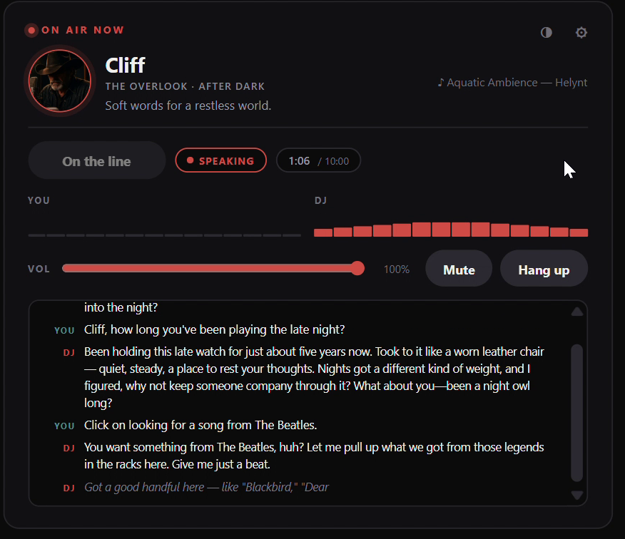
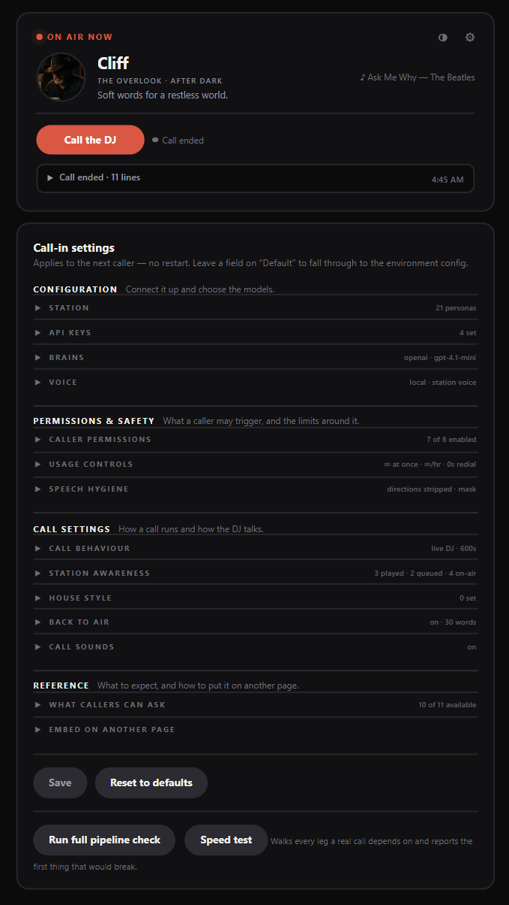

# Talk Wave

**Live voice call-ins for a [SUB/WAVE](https://github.com/perminder-klair/subwave) AI radio station.** A listener presses
one button in the browser, talks with whoever is live on air, and the DJ can
act on the station mid-call — search the library, queue a request, put a
shoutout on the broadcast.

The call is not the station speaking. It's this sidecar's own realtime voice
agent wearing the live persona, and the station is only touched when the agent
uses an allowlisted tool.

Please note this was created with use of AI. It is recommended to use it
locally and only expose it externally if you know the risks and what you are
doing.

<table>
<tr>
<td valign="top"></td>
<td valign="top"></td>
</tr>
</table>

▶ **[Watch a real call (2 min)](docs/talkwave-call.mp4)** — in-persona pickup,
back-and-forth, and a Beatles request resolved against the live library.

```
[browser mic] --WebRTC--> [livekit-server] --> [agent-worker]
                                                STT -> LLM -> TTS
                                                     |
                                          SUB/WAVE MCP (allowlisted)
```

## Documentation

The README is the short version. The detail lives here:

| | |
|---|---|
| **[Getting started](#getting-started)** | Docker, or local on Windows |
| **[Settings reference](docs/settings.md)** | Every setting, its default, and what it changes |
| **[Calling from outside your network](docs/networking.md)** | The three topologies, and why a call can connect with no audio |
| **[Security and privacy](docs/security.md)** | The exposure checklist, the two passwords, what is enforced |
| **[Troubleshooting](docs/troubleshooting.md)** | Known limits, reading a call back, logs and tests |
| **[Voicemail](docs/VOICEMAIL.md)** | The answering machine: staged greetings, where messages go, and what is deliberately never recorded |


## Features

**The call**
- One button; whoever is live on air answers, in persona, aware of the show,
  recent tracks, and what it just said on the broadcast.
- Full-duplex with barge-in. Live captions both ways, state and level meters,
  call timer — every indicator driven by a real signal.
- Caller actions get their own transcript line. The DJ *saying* it did
  something is a claim; that line is the receipt.
- Ring, pickup, hold, hang-up and engaged tones from shipped sound sets — Exchange, Handset, Modern and Rotary synthesized in the box, plus recorded dial-up handshakes and genuine North American line tones (public domain, receipts in the catalog) — every slot replaceable from a searchable, filterable shelf of clips and your own uploads. The ring yields the moment the DJ answers. See [Call sounds](docs/settings.md#call-sounds).
- A text line: typed chat with whoever is on air — same brain, same tools, same receipts, over a plain WebSocket, so it works where WebRTC can't and keeps working when the media server is down. Resumable per browser, closed by idle and ceiling clocks, and gated like the phone (the panel's **Text line** section holds the clocks; the dashboard holds the switch).
- An answering machine: staged per-persona greetings in each DJ's own voice, messages held for you or delivered to the station, and a kill switch that outranks everything — see [Voicemail](docs/VOICEMAIL.md).
- Push to talk (on by default, switchable per surface), with the bar release committing the turn so the DJ answers promptly instead of waiting out its endpointing delay. Per-DJ voice effects: each persona can wear its own radio colour — telephone, CB, shortwave, lo-fi and friends — applied in the caller's browser only.
- In-character timeouts for silence and over-long calls; a caller who was just
  asked a question gets three times the usual wait — unless nothing has ever
  been heard from them, in which case the DJ says so, names the microphone as
  the likely cause, and lets them go promptly rather than patiently. If no
  worker answers, an engaged tone after 40 seconds rather than endless ringing.
- Every line the DJ is made to say has a plain one behind it, so a model
  outage can never turn a goodbye into silence.
- The DJ closes the call itself, with a configurable floor (60s by default)
  stopping it hanging up early whatever the model decides.
- Optionally, a thumbs up or down when the line drops. The answer is stored
  against that call's own transcript, so "find me the bad ones" is a question
  the panel can answer.
- Every call is written down — see
  [Diagnosing a call](docs/troubleshooting.md#diagnosing-a-call).
- **Installs to a phone like an app, and feels like one.** Add it to the home
  screen and it opens full-screen as a progressive web app — the DJ's portrait
  leading the top, the words and state in the middle, the actions under your
  thumb. Whether you call, text, or leave a message, it reads like the real
  thing on a phone rather than a card on a page.

**Station integration**
- Tools come from the station's MCP server through an allowlist: requests
  (optionally confirmed first), search, exact queueing, announcements,
  segments, and — off by default because they reach every listener rather than
  the caller — skipping the current track and firing a programme beat. Sound
  effects and playlist rebuilds are **never** exposed at any setting. The panel
  lists every tool with each one's status, so the boundary is visible.
- Anything that changes something is a local wrapper, not a raw MCP call, so
  **Actions per call** caps it. That distinction is the ceiling: a tool served
  straight over MCP would have none.
- The DJ knows genre, mood, BPM, key and listener count where the station
  publishes them. A queued request returns its position, so "third up, about
  ten minutes" replaces implying it's playing now.
- Personas, cards, voices and model lists are discovered live. Point it at
  another SUB/WAVE and it re-homes itself.
- **Overlap protection** (default on): the call DJ and the on-air DJ are the
  same person, so while the station has the microphone the caller's replies
  queue rather than talk over the broadcast. Nothing is lost, and the card
  shows **On air** so the pause reads as the station being busy.
- Every call is a first call — the previous caller's business never reaches the
  next caller's prompt.
- The caller's browser is optionally tuned into the stream at pickup, so
  stations that refuse requests at zero listeners accept them.

**Operator panel** (its own page at `/settings`)
- A dashboard up top in four labelled groups: **Transmission** — The Line's kill switch with a real toggle, and who may call — beside a **Station** group (who is on air, station health, the configured call chain), with **Live calls** and **Voicemail** each pairing their own switch with the traffic it produces. Every switch posts the moment it is pressed, no save, no restart; pausing the line holds the two doors in amber.
- Every runtime choice below it: station, providers, permissions, limits, call
  behaviour, house style. Changes apply to the next caller.
- API keys are entered in the section that uses them — model keys under
  Brains, speech keys under Voice and Ears, the station login under SUB/WAVE
  Station — stored server-side and never sent back to the browser.
- Test buttons exercise the real code paths — green means the call will work,
  not "the URL responded".

**Safety and limits** — two passwords (panel and phone, separately
rate-limited), usage caps on concurrency, hour, day, redial and actions, plus a
pause switch. Speech hygiene runs on every line before it reaches the voice.
Refusals are phrased in-world, never as codes. The caller is treated as an
untrusted stranger: stated in the prompt, enforced by the allowlist,
cross-origin writes refused. See [Security](docs/security.md).

## Architecture

| Component | What it does |
|---|---|
| `livekit-server` | WebRTC media — one room per call |
| `agent-worker` | Resolves the persona, builds the prompt, runs STT → LLM → TTS with MCP tools attached |
| `token-server` | Mints join tokens (the browser never sees LiveKit secrets), serves widget and panel, proxies station reads |
| `web-widget` | The call page — installable to a phone's home screen, or a compact embeddable card |

Inside the worker, one call is one `CallSession` and every file under
`agent-worker/call/` is named after its job: the session and its lifecycle, the
tool registry and wrappers, the provider builders, the on-air gate, the action
ledger and the written record. `registry.py` describes the tool surface
**once** — the allowlist and the panel's reference both derive from it, so
adding a tool is one table entry plus one function.

The prompt is assembled in `agent-worker/brain/`: `briefing.py` is what the DJ
**knows** (now playing, recent, queue, its own on-air lines, segments),
`conduct.py` is how it **behaves** (momentum, triage, closing, tool etiquette,
safety), `assemble.py` joins both onto the persona and show cards. They change
for unrelated reasons — a new station field edits briefing, a bad call edits
conduct — so neither imports the other, and a test enforces it.

**Providers** are pluggable per leg, matching what a SUB/WAVE station itself
can point at: LLM (OpenAI, Google, Anthropic, DeepSeek, the OpenRouter /
Requesty / Vercel AI Gateway aggregators, Ollama), STT (Deepgram, OpenAI,
Google, or in-process faster-whisper on CPU — no key, no network), TTS (any
OpenAI-compatible endpoint, described by a JSON adapter, so a new backend is a
config file — ElevenLabs and Fish Audio adapters ship in the box, plus one
matching SUB/WAVE's own Remote `/speak` contract so a TTS server built for the
station carries the call line too).

**The caller's microphone is cleaned up before it is heard.** Echo cancellation,
noise suppression and automatic gain control are applied to the caller's audio
by default — so a listener who dials in with the station playing in the room
isn't transcribed over their own speaker, and on a speakerphone the DJ's voice
is kept out of the caller's own transcript. For the sharpest transcription,
especially from a phone in a noisy place, a **cloud STT** (Deepgram, OpenAI or
Google) reads more accurately than the in-process faster-whisper base model,
which trades some accuracy for needing no key and no network — a good default to
start on, worth upgrading if callers are misheard. **TTS** is the same trade: a
cloud voice (ElevenLabs, Fish Audio, or the station's own Remote `/speak`) is
warmer and quicker to first audio than a local model on CPU, and matching the
voice the station already uses keeps the call-in DJ sounding like the on-air one.

**Performance**: the station's slow endpoint is kept warm by a background ping,
per-call reads are one concurrent snapshot, and the prompt is budgeted because
every token is paid on time-to-first-token every turn. Local TTS and STT are
measured honestly — the pipeline check reports realtime factors and warns when
a backend can't keep pace with playback.

**The TTS checks assume nothing.** Swapping speech engines fails quietly more
often than loudly, so the test buttons measure rather than trust: the declared
sample rate is checked against the rate in the backend's own wav header (get it
wrong and audio plays at the wrong speed and pitch with no error anywhere), the
voice list is read from the path the adapter names in whatever shape the
backend answers in, every persona's voice is checked against that list rather
than only the DJ who happens to be on air, and when a backend refuses, what it
actually said is what you read.

## Credentials & privacy

**Station admin credentials are optional, and never leave your box.** Entering your SUB/WAVE admin login unlocks the advanced on-air features — putting a different show on air, running segments and skills, skipping tracks, mirroring persona voices. Without it, everything else still works. The credentials are entered by the operator into their **own self-hosted instance**, stored server-side and write-only (the panel shows only a fixed mask — never the value, never its length), behind the instance's own admin password — and every caller-facing action they unlock is off by default and individually permission-gated. There is no third party anywhere in the path: the author runs no servers at all.

Two things worth knowing as an operator: caller audio is processed by whichever speech and AI providers **you** configure (it runs fully local with Ollama and the bundled Whisper, or on your own cloud keys), and calls can be transcribed and stored **on your own server** with configurable retention — the card shows a Recording indicator while that's on. Nothing phones home, there is no telemetry, and Talk Wave never touches the broadcast stream.

## Getting started

### Docker (recommended)

Images publish to `ghcr.io/mrain1p/talk-wave`; `:latest` tracks `main`. The
image includes the widget. A deploy needs five files:

```
talk-wave/
├── docker-compose.yaml    # from this repo
├── Caddyfile              # from this repo — the TLS front door mounts it
├── .env                   # from .env.example — REQUIRED
├── livekit.yaml           # from livekit.example.yaml, with a fresh secret
└── data/                  # panel settings and keys persist here
```

```bash
cp .env.example .env
cp livekit.example.yaml livekit.yaml   # generate a fresh secret for it
mkdir -p data && chown -R 1000:1000 data && chmod -R u+rwX data
docker compose up -d
```

Both processes run as **uid 1000**, so `data/` has to belong to it — that is
what the third line does. On filesystems that create files with no permission
bits (Synology shares among them) the `chmod` is what lets the app read its
own settings, so run both.

**`HOST_IP`** is the one deployment variable — the docker host's LAN address,
driving LiveKit's advertised media address, the browser URL and the webhook
callback. Otherwise `.env` only needs the LiveKit keypair; the rest is panel.

**`SUBWAVE_STREAM_URL`** should be the station's public `https://` stream. Left
blank it derives from the station's own address, which is plain http on the
LAN — and since the widget must be served over TLS for the microphone to work,
the browser blocks that stream as mixed content and the caller hears no
station. It fails silently, so set it first. A bare origin is enough; the
station's published mounts are discovered, mp3 first.

**Open `https://<HOST_IP>:8443`**, the bundled Caddy TLS front door. Browsers
only allow the microphone on HTTPS origins; the first visit shows a one-time
certificate screen. Add an API key, run the pipeline check, press Call. Plain
`http://<HOST_IP>:8100` works for everything except placing calls.

**Do you need the bundled Caddy?** Only for TLS, and only because the
microphone requires it — it is the zero-config way to get an HTTPS origin on a
LAN. If you already run a reverse proxy (Caddy, Traefik, nginx, a NAS's built
in one), delete the `caddy` service and terminate TLS there instead — but
replicate both routes from the `Caddyfile`, not just one: the widget to
`token-server:8100` **and** `/rtc` to `livekit-server:7880` (WebSocket). The
`/rtc` half is the one people forget; without it the page loads, the call
connects, and no audio ever flows. Set `LIVEKIT_PUBLIC_URL` to
`wss://your-hostname` so the browser signals through the same origin.

### Local, no Docker (Windows)

```powershell
python -m venv .venv
.\.venv\Scripts\pip install -r agent-worker\requirements.txt
# put livekit-server.exe in bin\  (github.com/livekit/livekit/releases)
copy .env.example .env
copy livekit.example.yaml livekit.yaml
.\run-local.ps1        # stop with .\run-local.ps1 -Stop
```

### Upgrading from Wave Talk (pre-0.10.52)

The app was renamed to Talk Wave at 0.10.52. One change is required in an existing compose: the image is now `ghcr.io/mrain1p/talk-wave` — GitHub redirects renamed repositories but **not** GHCR packages, so the old `wave-talk` image is frozen at its last build and a stack still pointing at it silently stops receiving updates. Swap the image name on both python services, then `docker compose pull && docker compose up -d`.

Nothing else migrates: `data/`, `livekit.yaml` and every environment variable keep their names and formats. Optional, for tidiness: adopt the new service/container names (`talkwave-worker`, `talkwave-web`) and the `talkwave-cache` volume from the current compose — the volume rename costs a one-time re-download of the ~141MB STT model.

## Embedding

```html
<div id="subwave-callin"></div>
<script src="https://your-host/embed.js"></script>
```

Renders the compact card in an iframe with `allow="microphone"` set (its
absence is the classic silent embed failure). The panel never ships in an
embed.

**What the card shows in an embed is answered separately** from what it shows
on the standalone page — see **What the card shows** in the panel. The host page
usually has its own show heading and now-playing line, and a second copy of
both inside the frame is noise. The settings gear is the one thing that is
never offered here at any setting: an embed does not load the panel's code, so
it would open nothing.

| Attribute | Effect |
|---|---|
| `data-theme="light\|dark\|inherit"` | The widget *starts* on this theme — `inherit` matches the host page's background (resolved before the frame loads, since a cross-origin frame can't see its parent) — but the viewer's toggle still works and their choice is remembered. The toggle cycles light → dark → the station's show colours (when the panel has them on offer) → match the page. Omit for OS preference |
| `data-lock-theme="true"` | Pin `data-theme` outright and remove the toggle, for a page that needs one look |
| `data-captions="ticker\|full\|off"` | Embeds default to `ticker` — latest line only, fading, so the widget stays short |
| `data-height="260px"` | Frame height for tight layouts |
| `data-compact="false"` | Full card instead of the compact one |
| `data-origin` | Widget origin when the script is served from elsewhere |
| `data-mode="launcher\|dock\|button"` | An off-the-shelf shape that *opens on a press* instead of sitting inline: `launcher` is a floating call pill in a page corner, `dock` a slim bar pinned across the bottom, `button` an inline button in the page flow that opens the card in a centred pop-up. All three name who answers (or say the line is closed) before they are pressed, and collapsing one never hangs up a call in progress. Pick one — and preview it — in the panel's **Embed** section |
| `data-position="left"` | Puts the launcher pill in the left corner (right is the default) |

**The station's own colours** are not an embed attribute — set **Player
settings → Colours → "The station's own colours"** in the panel and every
surface, embeds included, wears the on-air show's palette live from the
station's `/themes` (a host's `data-theme` is only the starting point, so it
does not block this). A host page can also push its own palette *and fonts*
into the card over `postMessage` — see `web-widget/HOST-STYLE-GUIDE.md` —
which repaints in place without dropping a call.

Any page you embed on can mint call tokens, so treat an embed as publishing the
phone. Set a guest code if that isn't what you want.

## License

MIT — free to use, tinker with, and build on. See [LICENSE](LICENSE).
